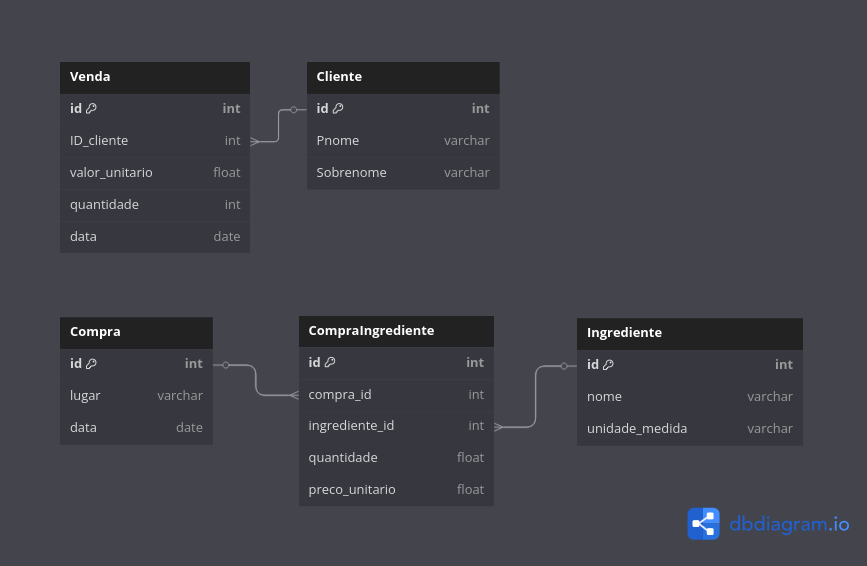

# FarofaCida
App para controle de vendas de farofa \
Feito no Android Studio usando Java e Kotlin

## Estrutura do Pojeto 
app  
├── src  
│ └── main  
│ ├── java  
│ │ └── com/gabriel/FarofaCida   
│ │ ├── ui # Interface do usuário (Activities, Fragments, Composables)  
│ │ ├── data # Fontes de dados (Repositorios, Models)  
│ │ ├── domain  
│ │ ├── di  # Injeção de Dependência  
│ │ └── util # Classes de utilidades  
│ └── res # Recursos (Layouts, Drawables, Strings)  
└── build.gradle.kts # Configuração do build do módulo  

### Banco de dados
* SQLite
* Diagrama do BD: 

## API
* Pagamento por pix

   

## Feito Por Gabriel da Silva Souza
* [GitHub](https://github.com/Gabriel-Souza18)  
* [Linkedin](https://www.linkedin.com/in/gabriel-souza-563701347/)  
* [Gmail](gabrielsisou@gmail.com)  
